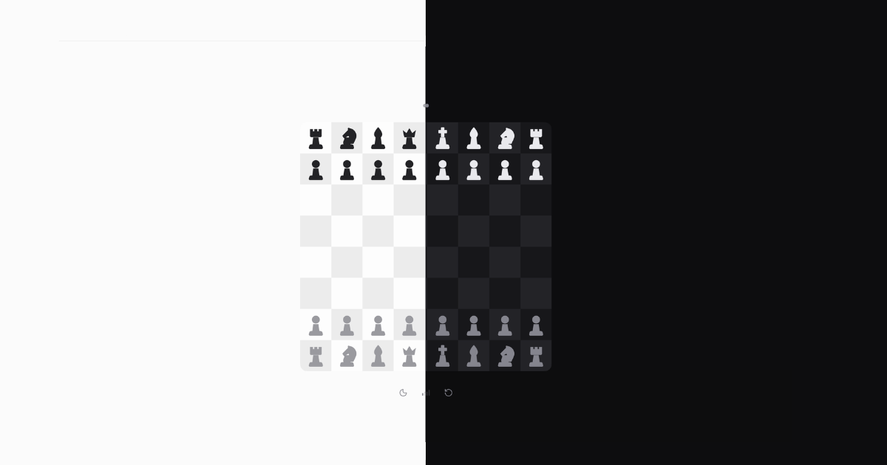

# sixtyfour

A very small chess game. One board, a handful of round controls, and a bot at three
difficulties. Or a friend, over a shared link.

[Play it](https://sixtyfour-liart.vercel.app)



The whole product is a single screen, and during a game the only text on it is the material
lead. Everything else is carried by the board: tint for state, motion for what just
happened, and a screen-reader live region for everything a sighted player reads from those
two.

## Running it

```bash
pnpm install
pnpm dev
```

`pnpm check` is the gate: lint, typecheck, tests, build. `pnpm verify` runs the built app
in a real browser and asserts against the live DOM. Run it after `pnpm build`.

To play a friend you also need the room server, which is a separate process:

```bash
pnpm room
```

It keeps rooms in memory unless `REDIS_URL` is set, which is fine for one process on a
laptop and wrong for anything else. `CLAUDE.md` lists the four environment variables.

## What is in here

Everything the game needs is written in this repository.

- **The chess engine.** A 0x88 board with make and unmake, verified by perft against six
  standard positions to depth 5. It runs at 8 to 10 million nodes per second.
- **The bot.** Alpha-beta with iterative deepening, MVV-LVA move ordering, killer moves,
  and a quiescence search. Hard runs under a 400ms budget and typically reaches depth 5 to
  7. It is then held back for 1200ms before it plays, because a reply in four milliseconds
  reads as the board glitching rather than as a move. A move takes 190ms to travel, so the
  gap you actually perceive is a beat over a second.
- **The motion.** No animation library. Springs are sampled into CSS `linear()` easings,
  and pieces live in one absolutely positioned overlay so a move is a single `transform`
  transition on a node that never unmounts.
- **The corners.** A continuous-corner ("squircle") path generator, 40 lines of code, with
  a golden-path test. `corner-shape: squircle` is Chromium only, so the path is what ships.
- **The sound.** Three clips totalling 13.5KB, each trimmed to its audible part. Mute is
  checked in one place, so nothing can make a noise by forgetting to ask.
- **The rooms.** A WebSocket server on plain Node, with Redis holding the rooms and fanning
  messages between processes so two players who land on different instances still see each
  other. The server validates every move with the same engine the browser runs, because a
  client is a thing anyone can rewrite. Every rule sits in one pure module that knows about
  neither sockets nor Redis, so the races that matter are tested in milliseconds and then
  re-tested unchanged against the live store.

Three dependencies were considered and measured away: a chess library (ours is faster than
the search needs), an animation library (CSS covers it), and a squircle library (40 lines).

## Layout

```
app/              layout, page, globals.css with every colour token
components/game/  the one feature: board, pieces, controls, hooks
components/ui/    button, tooltip, confirm dialog
lib/chess/        pure engine, no React
lib/bot/          pure search plus the worker entry, no React
lib/game/         reducer and piece identity, pure so node --test can reach it
lib/room/         every rule a room has, plus the wire types both sides import
lib/sound.ts      every clip and its volume
lib/preferences.ts  difficulty, side and mute, stored and read back
server/           the room server process, never imported by the site
scripts/verify.mjs  drives the built app in Chrome, including two pages in one room
```

`CLAUDE.md` holds the project rules. `PLAN.md` is the plan of record, including what was
measured before the build started and where the build diverged from it. `MULTIPLAYER.md`
does the same for rooms.
